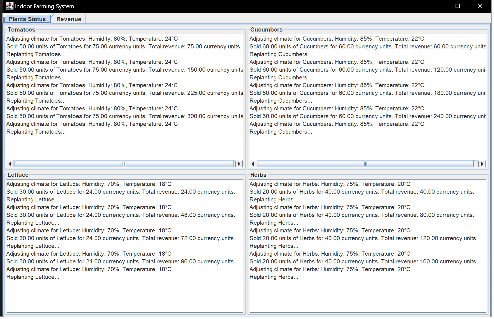
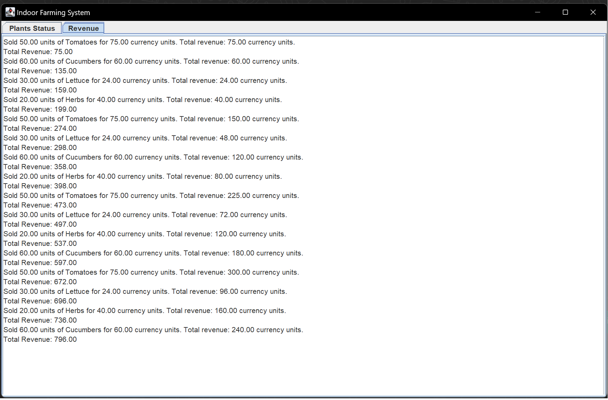
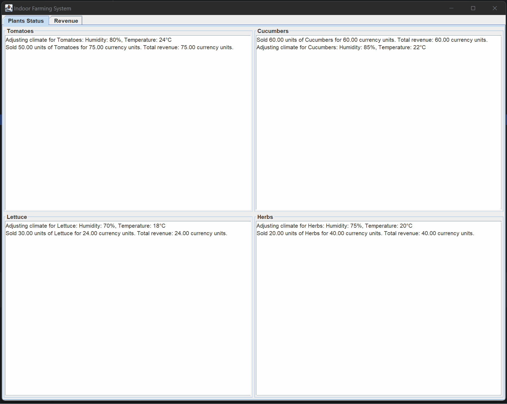

# Fully Autonomous Indoor Farming System

## Overview

The Fully Autonomous Indoor Farming System is a Java-based simulation designed to demonstrate the capabilities of multi-agent systems within an indoor farming environment. Utilizing the Java Agent DEvelopment Framework (JADE), this application simulates various farming operations such as climate control, growth monitoring, irrigation, lighting control, nutrient management, harvesting, and logistics/distribution of produce. The system supports multiple plant types including Tomatoes, Cucumbers, Lettuce, and Herbs.

## Features
- **Multi-Agent Coordination**: Implements several agents that manage different aspects of indoor farming operations, coordinating seamlessly to simulate a real indoor farm.
- **Real-Time Climate and Resource Management**: Adjusts climate conditions, irrigation, and nutrient supply in real-time based on the needs of each plant type.
- **Growth Monitoring and Harvesting**: Monitors the growth stages of plants and automates the harvesting process.
- **Interactive GUI**: Provides a graphical user interface for real-time monitoring and management of indoor farming operations.
- **Revenue Tracking**: Tracks revenue generated from the distribution of produce.
- **Logging and Monitoring**: Includes comprehensive logging of actions and a monitoring system that oversees farm operations.

## GUI Example

### Plant Status

### Revenue Tracking

### System Animation

## Prerequisites
- Java JDK 8 or higher
- Eclipse, IntelliJ IDEA, or any compatible Java IDE
- JADE (Java Agent DEvelopment Framework)

  
## System Architecture

The system integrates multiple Java classes and agents, each handling specific aspects of indoor farming management:

### Main Entry
- **MainController.java**: Initializes and starts all agents and the GUI component, setting the operational stage for the system.

### Agents 
- **ClimateControlAgent**: Manages climate conditions (humidity and temperature) for each plant type.
- **GrowthMonitoringAgent**: Monitors the growth stages of plants.
- **HarvestingAgent**: Automates the harvesting process when plants reach maturity.
- **IrrigationAgent**: Automates the watering schedule based on plant requirements.
- **LightingControlAgent**: Manages lighting duration to simulate day/night cycles.
- **LogisticsAndDistributionAgent**: Handles the distribution of harvested produce and logs revenue.
- **NutrientManagementAgent**: Provides nutrients to plants at scheduled intervals.

### GUI
- **MainFrame**: The main GUI window displaying plant statuses and total revenue.

### Configuration
- **SystemConfig**: Contains configuration settings for the simulation including climate settings, irrigation schedules, lighting schedules, nutrient schedules, and pricing information.

### Communication
- Agents communicate using ACL messages to manage tasks and share information efficiently.

## Usage

1. **Start the System**
   - Open your IDE and load the project.
   - Run `MainController.java` to start all agents and the GUI.

2. **Interact with the GUI**
   - Use the GUI to monitor plant statuses, adjust settings, and view revenue.

3. **Shutdown**
   - Close the GUI window or stop the IDE's running process to terminate the application.
